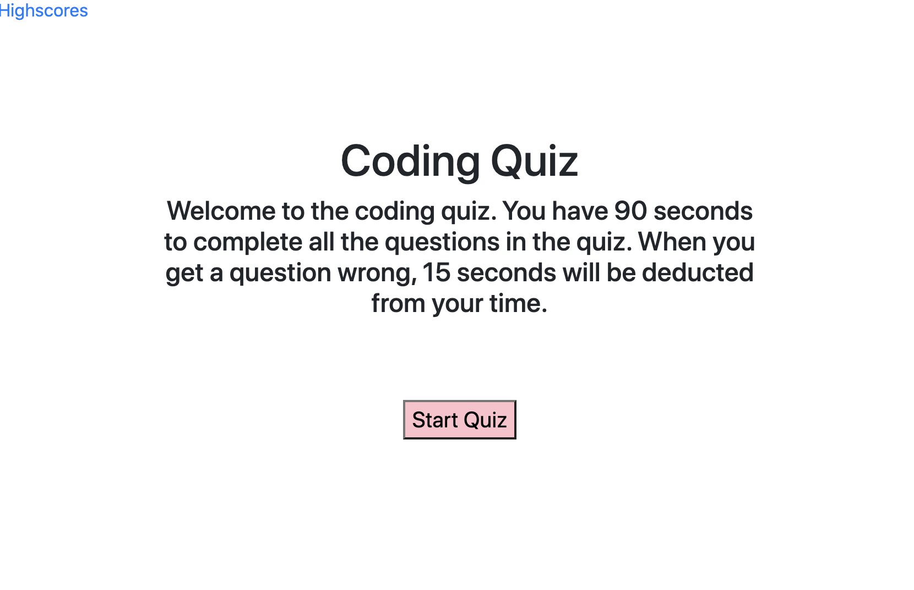
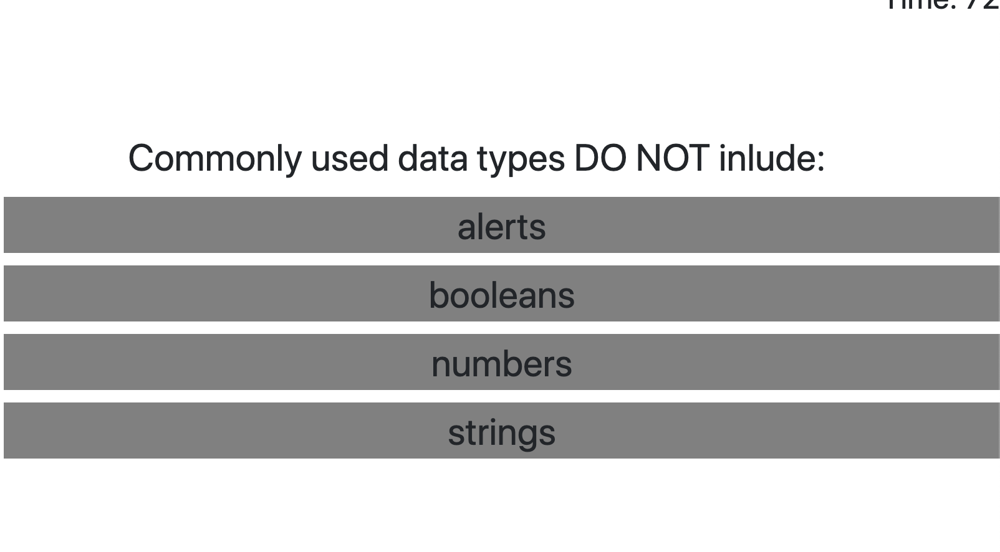
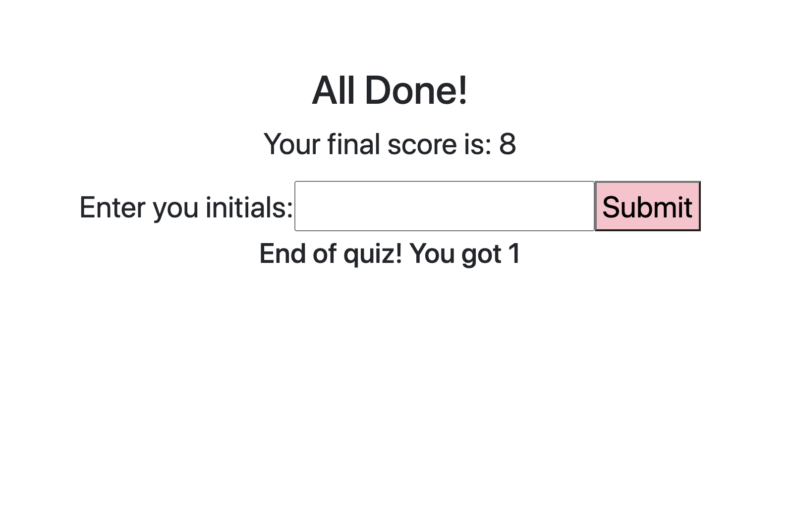

# Code-Quiz

For this assignment we were tasked to build a timed code quiz that has multiple choice questions. This quiz will run in the browser and has features dynamically updated HTML and CSS using Javascript. It is responsive to the user and has a clean and polished user interface. 

## User Story 

AS A coding bootcamp student 
  
I WANT to undertake a timed quizon Javascript fundamentals that stores high scores 
 
SO THAT I can gauge my progress to my peers

## Built With 

* VS Code (https://code.visualstudio.com/)
* Terminal 

## Screenshots 

## License 

This application does not have a license.

## Link to the app

<a href="https://chloeblackwell.github.io/Code-Quiz/.">Link to the application></a>

## Author 

Chloe Blackwell
  
Email: chloeblackwell2@hotmail.com
